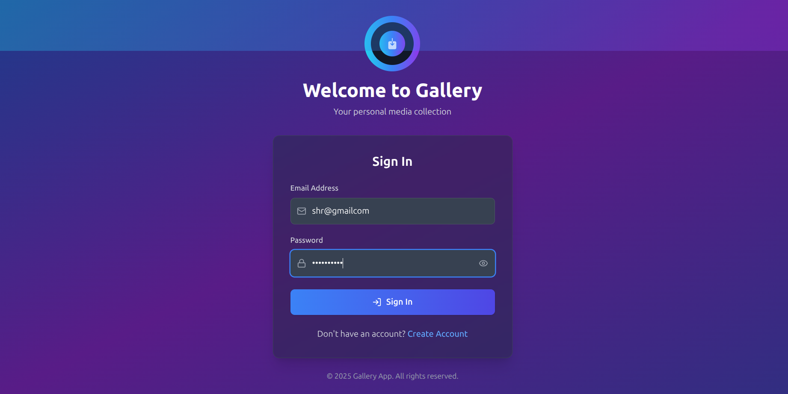
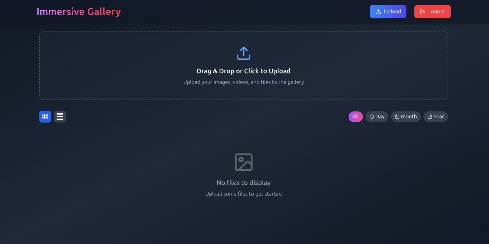
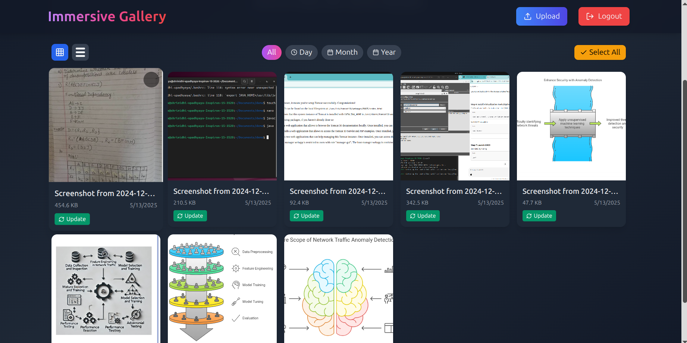

# 📸 Cloud Media Gallery using MERN Stack + AWS S3

A fullstack cloud-based image and video gallery built using the *MERN stack* with *AWS S3* for media storage. Authenticated users can securely upload, preview, update, and manage images and videos through an immersive and interactive dashboard.

---

## 🚀 Features

### 🔐 Authentication
- JWT-based authentication
- User registration and login
- Protected routes with middleware

### 📤 Media Upload
- Drag & drop upload or file picker
- Uploads images and videos to AWS S3
- Automatically extracts video duration using fluent-ffmpeg
- Stores file metadata in MongoDB (file name, size, type, date)

### 🖼 Gallery Dashboard
- Responsive *grid* and *list* layouts
- Toggle filters by *day, **month, or **year*
- Preview images and play videos inline
- Fullscreen view with overlay

### 🛠 Media Management
- Update existing files with new uploads
- Delete single or multiple files
- Real-time toast notifications for user actions

### 🧠 Metadata Display
- File name
- File size (bytes → MB)
- Upload date
- Video duration (HH:MM:SS)

---

## 🛠 Tech Stack

### 🔧 Backend
- Node.js
- Express.js
- MongoDB + Mongoose
- Multer for file handling
- AWS SDK for S3 integration
- fluent-ffmpeg for video metadata

### 💻 Frontend
- React.js
- Tailwind CSS for UI
- Lucide-react for icons
- React Toastify for notifications

---

## 📂 Folder Structure

```
root/
├── backend/
│   ├── models/
│   │   ├── User.js
│   │   ├── Image.js
│   │   └── Video.js
│   ├── middlewares/
│   │   └── authMiddleware.js
│   ├── errorMiddleware.js
│   ├── routes/
│   │   ├── auth.js
│   │   └── gallery.js
│   ├── config/
│   │   └── awsConfig.js
│   ├── app.js
│   └── .env
├── frontend/
│   └── src/
│       ├── components/
│       │   └── Dashboard.js
│       ├── App.js
│       └── index.js

```

---

## 🔐 Environment Variables

Create a .env file in the backend/ folder:

```
PORT=5000
MONGO_URI=your_mongo_connection_string
JWT_SECRET=your_jwt_secret
AWS_ACCESS_KEY_ID=your_aws_access_key
AWS_SECRET_ACCESS_KEY=your_aws_secret_key
AWS_REGION=your_aws_region
AWS_BUCKET_NAME=your_s3_bucket_name
```

---

## 🚀 Getting Started

### 🧰 Prerequisites
- Node.js & npm
- MongoDB (local or Atlas)
- AWS S3 bucket setup

---

### 📦 Backend Setup

bash
cd backend
npm install
node app.js


---

### 💻 Frontend Setup

bash
cd frontend
npm install
npm start


> 🔐 Make sure to store the JWT token in localStorage after login for API access.

---

## ✨ Screenshots

Below are a few screenshots from the Cloud Media Gallery app:

### 🔐 Sign In Page



---
### 🖼️  Home View




---
### 🏠 Home Page



---


## 👥 Team Credits

Built with ❤ by:
- [*Shamanth Krishna V.R*](https://github.com/Shamanth-k)

- [*Shrinidhi Upadhyaya*](https://github.com/Shrinidhi972004)

- [*Sudhama Bhat*](https://github.com/Sudhama-bhat)

- *Raviraj M.J*

---

## 📄 License

This project is open source and available under the [MIT License](LICENSE).

---

## 📬 Feedback

Have ideas to improve this project? Feel free to open issues or submit pull requests!

---

## 🔗 Let's Connect

- [*Shamanth Krishna V.R*](www.linkedin.com/in/shamanth-krishna-v-r-89178b267)
- [*Shrinidhi Upadhyaya*](https://www.linkedin.com/in/shrinidhi-upadhyaya-82114a26a)
- [*Sudhama Bhat*](https://www.linkedin.com/in/sudhama-bhat-349a31241)
- *Raviraj M.J*
